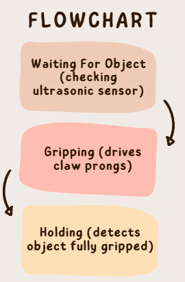
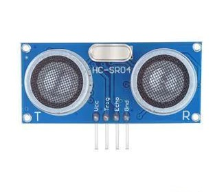
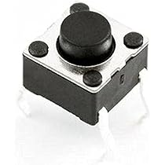
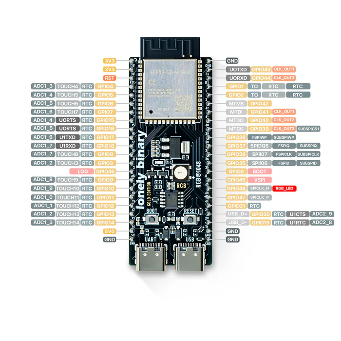
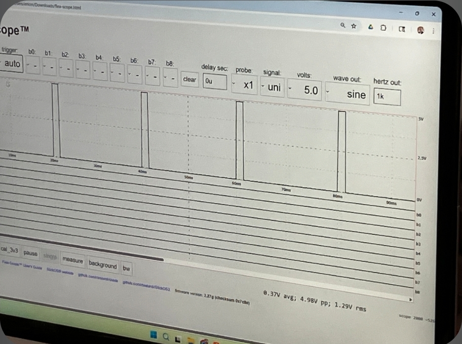

# **Autonomous Claw Gripping Mechanism**

## Claw Mechanism – Video Demo

## 📖 Project Documentation
> **Note:** For the full, live-updated technical logs including high-res diagrams and detailed troubleshooting, please view the official Google Doc below.

## Introduction
The original intention behind this project was to design and develop a drone mechanism that was capable of autonomously going to a location, detecting an object using Computer Vision, and then using sensors (ultrasonic sensors and limit switches) to sense proximity to the object and how well gripped the object is. Because of timeline constraints and project requirements, my partner, Rayyan, and I pivoted. We focused on developing the claw mechanism and will continue the project outside of the class when time permits. This GitHub goes over our design process, objectives, and progress for the claw gripping mechanism. 

## Concept
Utilizing the PLTW curriculum, the mechanism was analyzed through a state machine-like perspective. A flowchart was developed to describe what the claw was designed to do. This visualization was useful in keeping the scope of the project consistent, and also serves as a coding flowchart for what the code should reflect. 

## Part Selection
### Sensors
An ultrasonic sensor was necessary to sense the distance from the claw gripping mechanism to the object. The [Elegoo HC-SR04](https://us.elegoo.com/products/elegoo-ultrasonic-sensor-kit?srsltid=AfmBOopR5ByhwLNMcnsA_8Amvfx4RrA7DNE-4UT02PolGaRuG4Qwy_L2) was chosen because it is inexpensive but does the job, and works well with most microcontrollers such as Arduinos and ESP32s

To detect the object, a couple of options could be pursued. A force sensor could be embedded into the prong of the claw. A limit switch could also be embedded into the prong of the claw. Ultimately, the final decision was to go with a limit switch-like system where a [4 Pin Momentary Push Button Switch](https://www.robotpark.com/IC-200-4-Pin-6x6x2mm-Tactile-Push-Button-Switch) would send a signal to the microcontroller via GPIO pins and a pull-up circuit, which would in turn cause the claw prong to stop.

### Motor
A motor was necessary to drive the claw mechanism. Using gears mitigates having multiple motors to drive the two prongs. A stepper, servo, or continuous servo motor would suffice. In the selection process, it was pivotal to have a claw with high torque. In the end, the [DS3235SG Servo Motor](https://www.amazon.com/ZOSKAY-Coreless-Digital-Stainless-arduino/dp/B07SBYZ4G5?th=1) was selected because of its high reliability, control angle, and sufficient grip strength. 

### Microcontroller
A microcontroller was necessary to process sensors, handle inputs, and exert outputs. Because of the price constraints relating to the project, our options were narrowed down to an Arduino Uno R3 and the ESP32 S3 Dev board. In the drone, it would be important to have a WiFi and Bluetooth system to communicate commands from the ground station to the drone. Due to the [ESP32 S3](https://lonelybinary.com/en-us/products/s3?variant=43784065712285) having Bluetooth capabilities, it was selected for the claw gripping mechanism. 

### Claw
Using a CAD model and a 3D printer, it was feasible to 3D print the claw pieces. M4 screws were selected to assemble the claw because they were readily available. PLA was selected because it is durable and cost-efficient. In the drone build, it would be strategical to use a lighter weight filament depending on drone requirements. 

## CAD Model

### Claw Mechanism
The claw mechanism uses double-helical gears, known for their superior load capacity and high efficiency, to drive the claw prongs. Liam Sagi and I collaborated on the claw mechanism, as both of our projects required a claw gripping mechanism. 

📦 **STL (3D Preview Available):**  
[Original Full Assembly](CAD/Original_Full_Assembly.stl)

However, our mechanisms differed in housing a system that would be able to detect when an object was fully gripped. I made modifications to the CAD file and created housings for mini pushbuttons to be housed. The modifications to the prongs as well as to the mounting are visible below.

🦾**STL (3D Preview Available):**
[Claw Prong 1](CAD/Claw_Prong_1.stl), 
[Claw Prong 2](CAD/Claw_Prong_2.stl), 
[Modified Mounting](CAD/Modified_Mounting_Mechanism.stl).

## Technical Skills Exerted

### Multimeter
One skill well utilized throughout this project was the use of a multimeter. It was incredibly useful to check whether or not a signal was being transmitted at all

### PicoScope
PicoScope is an alternative to the oscilloscope. Mr. Marc-Aurele introduced it and used it to help me understand the effect of Pulse Width Modulation (PWM). It was incredibly useful to see how the PWM value correlates to the signal's graph.

### CAD
Another skill exemplified throughout this project was the ability to modify pre-existing designs in Fusion360. It was important to adjust the claw mechanism to accommodate the mini push button and to adjust the mounting mechanism to better accommodate Claw Prong 2.

### Coding C
A major skill exemplified throughout this project was the ability to code the whole mechanism. 

## Reflection
### Time Management & Planning
One lesson learned was the importance of time management and planning. If a timeline was properly mapped beforehand, with specific objectives required by certain dates, it would have driven the project further. Not going through the motion of properly planning and the engineering design process cost us precious time and made us less efficient. Going forward on future projects, it would be important to make these changes: starting with a problem statement, brainstorming possible solutions, going through a decision matrix, coming up with an organized timeline, and detailing every step of the way both in GitHub and in an Engineering Notebook. 

### Next Steps
Rayyan and I plan to incorporate the claw with the Computer Vision that he has developed. Here is his [GitHub](https://github.com/Maro1810/Payload-Dropping-Drone-DE-Final). We aim to continue this project, and have done research into what goes into making a drone. 

## Sources & Credits
Credit to Mr. Marc-Aurele for his relentless effort and contributions to making this project work! Without his support, this project would not have been possible.
Credit to Rayyan Hussain, my partner, for his contributions and mindset that kept us going. Your coding support was truly appreciated
Credit to Liam Sagi for the initial claw mechanism CAD, and the 4-pin bottons
Credit to William for providing the Servo Motor

[ESP32Servo](https://github.com/madhephaestus/ESP32Servo)  
[Ultrasonic Sensor Guide](https://randomnerdtutorials.com/complete-guide-for-ultrasonic-sensor-hc-sr04/)  

